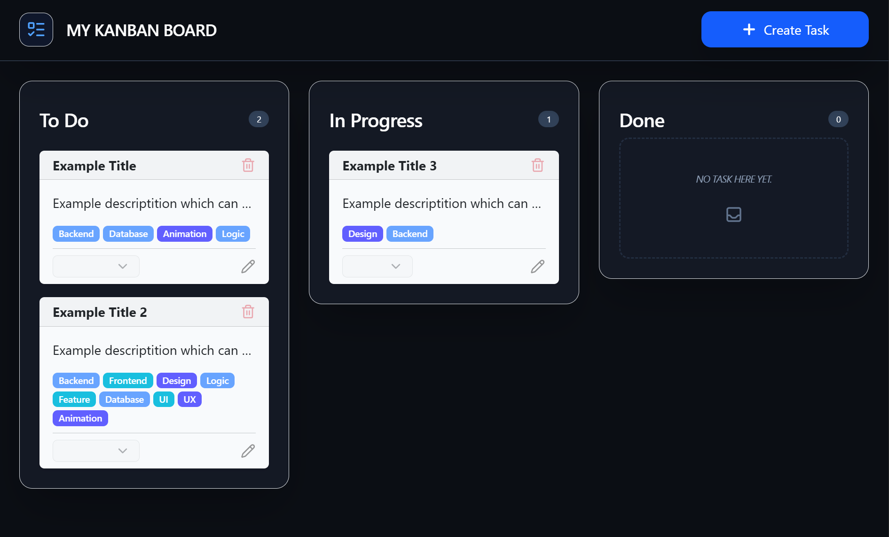

# Fullstack Kanban Board

Ein interaktives Kanban-Board, entwickelt im Rahmen des Studiums **Medieninformatik** als eigenes Projekt. Dieses Projekt demonstriert das Zusammenspiel zwischen einem modernen Frontend (Vue.js) und einem persistenten Cloud-Backend (Node.js/Express + MongoDB).

## Link
https://kanban-board-fullstack-theta.vercel.app/



## Features

- **Persistente Datenhaltung:** Aufgaben werden sicher in einer MongoDB Atlas Cloud-Datenbank gespeichert.
- **REST-API:** Vollständige CRUD-Operationen (Create, Read, Update, Delete) über ein Express-Backend.
- **Decoupled Architecture:** Frontend und Backend sind getrennt gehostet für maximale Skalierbarkeit.
- **Tag-System:** Dynamische Kategorisierung von Aufgaben mit semantischer Farblogik.
- **Modernes UI:** Responsives Glassmorphism-Design mit Vue.js 3 und Tailwind CSS.
- **Optimierte UX:** Visuelles Feedback durch Blur-Effekte während der Server-Synchronisation.

## Architektur & Tech-Stack

Das Projekt folgt dem Prinzip der **getrennten Verantwortlichkeiten** (Separation of Concerns):

- **Frontend:** Vue.js 3 (Composition API) + Pinia (State Management) -> Gehostet auf **Vercel**.
- **Backend:** Node.js + Express.js -> Gehostet auf **Render**.
- **Datenbank:** MongoDB Atlas (NoSQL Cloud Hosting).

## Installation & Setup

1. **Repository klonen:**
   ```bash
   git clone [https://github.com/SimonPede/kanban-board-fullstack.git](https://github.com/SimonPede/kanban-board-fullstack.git)

2. **Backend konfigurieren**
   ```bash
   cd server
   npm install
   ```
   Erstelle eine .env Datei im server-Ordner und füge deinen MongoDB-Connection-String hinzu:
   ```bash
   MONGO_URI=mongodb+srv://<USER>:<PASSWORD>@cluster.mongodb.net/kanban
   ```

3. **Frontend konfigurieren:**
   ```bash
      cd ../frontend
      npm install
   ```
   Erstelle eine .env Datei im frontend-Ordner:
   ```bash
      VITE_API_URL=http://localhost:3000
   ```

4. **Anwendung starten (lokal):**
   - backend: node index .js im Server-Verzeichnis
   - frontend: npm run dev im Frontend-Verzeichnis

Die Anwendung ist nun unter http://localhost:5173 (Vite Standard) erreichbar.
